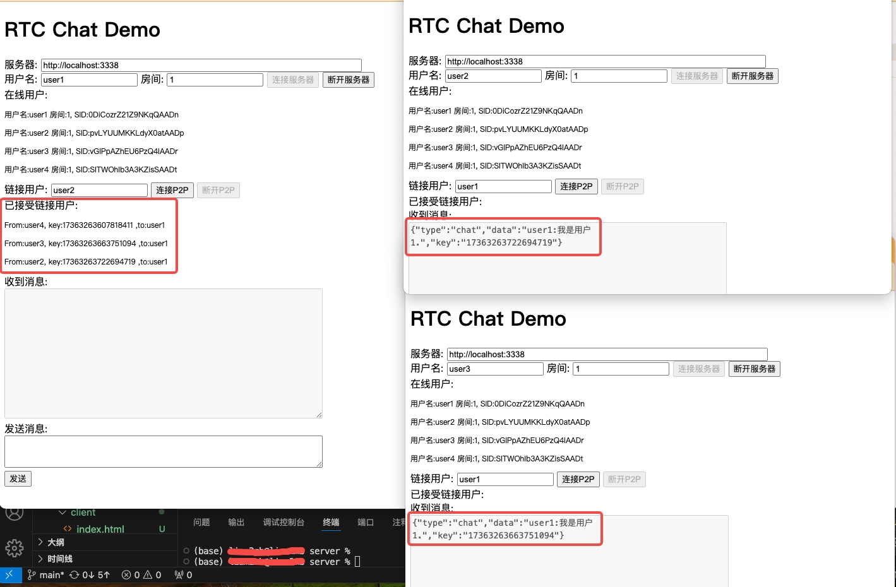

# WebRTC 一对一聊天

## 运行项目

1. 启动 serve

   执行命令

   ```bash
   cd server/go-websocket
   go run main.go
   ```

2. 启动 WebRTC 客户端

   ```bash
   npm install http-server -g
   cd client
   http-server
   ```

打开[http://localhost:8080](http://localhost:8080)，复制一个页签

**用户名唯一，房间号必须相同**

效果如图

